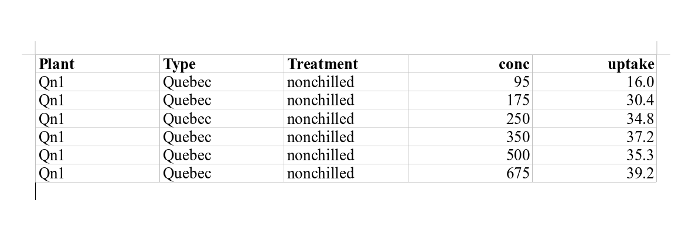

```{r echo = FALSE, message = FALSE}
knitr::opts_chunk$set(
  comment = "R> ",
  collapse = TRUE
)
library(inSilecoMisc)
```

This vignette is a short overview of *inSilecoMisc* organized around the following themes:

1. strings manipulations
2. vector manipulations
3. data frames manipulations
4. Mathematical functions


# String manipulations


## LoremIpsum

It is sometime useful to have a piece of random text to play with,
`loremIpsum()` display a piece of the commonly used placeholder text
[Lorem ipsum](https://en.wikipedia.org/wiki/Lorem_ipsum) with the option of
having a specific number of words.

```{r loremIpsum}
loremIpsum()
loremIpsum(10)
```


## Keep a selection of words or letters

Assuming I I need the second word, all I have to do is:


```{R}
keepWords(c(loremIpsum(18), "be or not to be"), 2)
```

and if I want a specific selection of words I cas use a sequence:

```{R}
keepWords(c(loremIpsum(18), "be or not to be"), c(1:4, 12:16))
```

As you may have notted, `NA`s are added when the position selected does not exist, this is useful but also annoying! Fortunately, a agument allow to
remove na


```{R}
keepWords(c(loremIpsum(18), "be or not to be"), c(1:4, 12:16), na.rm = TRUE)
```

Also `collapse = "-"` allows the user to change the character used to separate words:


```{R}
keepWords(loremIpsum(18), c(1:6, 14:18), collapse = "-")
```

and if `collapse=NULL` then list will be returned including a vector of the selected words per input string:

```{R}
keepWords(c(loremIpsum(18), "be or not to be"), c(2:3), collapse = NULL)
```

Not that all punctuation signs will be removed (this can be changed with argument `split_words `)!


There are two other functions that work similarly: `keepLetters()` and `keepInitials()`. The former allows the used to select letters


```{R}
keepLetters(loremIpsum(18), c(1:6, 14:18))
keepLetters(loremIpsum(18), c(1:6, 14:18), collapse = "-")
keepLetters(loremIpsum(18), c(1:6, 14:18), collapse = NULL)
```

while the latter extracts initials

```{R}
keepInitials("National Basketball Association")
keepInitials("National Basketball Association", "-")
```

Note that is you have a mixture of lower and upper case, so will the output

```{R}
keepInitials("National basketball association")
```

if this annoys you, base functions `upper()` and `lower()` come in handy!

```{R}
keepInitials(tolower("National basketball association"))
keepInitials(toupper("National basketball association"))
```


## Adjust the size of a character string

`adjustStrings()` have 5 arguments to adjust strings of a character vector is a very flexible fashion:

1. `x`: the input character vector to be adjusted;
2. `n`: the number of characters to be added or used to constrain on the length of the  output strings;
3. `extra`: the character(s) to be added (`0` is the default value);
4. `align`: the string alignment ("right", "left" or "center");
5. `add`: whether `n` should be the constraint or a number of characters to be added (a constraint by default).


By default, `adjustStrings()` uses `n` as a constrain for the length of the output strings. so if use `n = 4` instead of `n = 2` in the first example, all
elements of the output vector will have 4 characters:

```{R n}
adjustStrings(1:10, n = 4)
```

Add I change the value of `extra` to specify the replacement character(s) to be used :

```{R extra}
adjustStrings(1:10, n = 4, extra = 1)
adjustStrings(1:10, n = 4, extra = "a")
adjustStrings(1:10, n = 4, extra = "-")
adjustStrings(1:10, n = 4, extra = "ab")
```

With `align`, I can choose where extra characters are added:


```{R align}
adjustStrings(1:10, n = 4, extra = "-", align = "right") # default
adjustStrings(1:10, n = 4, extra = "-", align = "left")
adjustStrings(1:10, n = 4, extra = "-", align = "center")
```

And if I want to add exactly `n` extra characters, `add = TRUE`, then exactly `n` extra characters are added to strings ():

```{R add}
adjustStrings(1:10, n = 4, extra = "-", align = "right", add = TRUE)
adjustStrings(1:10, n = 4, extra = "-", align = "left", add = TRUE)
adjustStrings(1:10, n = 4, extra = "-", align = "center", add = TRUE)
```

Note that in this case, lengths of out strings differ!
One last remark about how `adjustStrings()` works when `add = FALSE`: for a given string, there are 3 scenarios :

1. the string to be adjusted has more characters than `n`; in this case, the string is simply cut off:

```{R}
adjustStrings("ABCD", n = 2, extra = "efgh")
```

2. the string has more character but the number of character for the adjustment is smaller than the number of `extra`'s character; in this case, `extra` is cut off:

```{R}
adjustStrings("ABCD", n = 6, extra = "efgh")
```

3. finally, when `extra` is too short to adjust the string according to `n`, `extra` is repeated:

 ```{R}
 adjustStrings("ABCD", n = 14, extra = "efgh")
 ```


## Assign a symbol to a p-value

```{r signifSymbols}
sapply(c(.2, .08, .04, .008, 0.0001), signifSymbols)
```


## applyString

```{r stApply}
applyString("cool", FUN = toupper, pos = 1:2)
applyString(c("cool", "pro"), pattern = "o", FUN = toupper)
```


## Extract digits from strings

```{r getDigits}
getDigits(c("a1", "032hdje2832"))
```


# Vectors manipulations


## whichIs

```{r whichIs}
vec <- LETTERS[1:7]
spl <- sample(vec)
whichIs(vec, spl)
id <- unlist(whichIs(vec, spl))
spl[id]
```

## meanAlong

```{r meanAlong}
meanAlong(1:10, 2)
```

## scaleWithin

```{r scaleWithin}
val <- runif(1000, 0, 100)
res1 <- scaleWithin(val, 20, 40, 60)
```


# Data frame manipulation


## Assign a category

```{r categorize}
(seqv <- stats::runif(40))
categorize(seqv, categ=seq(0.1,0.9, 0.1))
```


## Turn a matrix or a data frame into a squared matrix

```{r squaretize}
mat <- matrix(1:15, 3, 5, dimnames = list(LETTERS[3:1], LETTERS[1:5]))
print(mat)
squaretize(mat, reorder = FALSE)
```


## Assign classes to data frames' columns

```{r setColClass}
df1 <- matrix(signif(runif(20),4), ncol = 2)
df2 <- setColClass(df1, 2, 'character')
str(df1)
str(df2)
```

## Create data frame from scratch or from other data frame

See also this [blog post on inSileco](https://insileco.github.io/2019/02/03/creating-empty-data-frames-with-dftemplate-and-dftemplatematch/).

```{r dfTemplate}
dfA <- data.frame(col1 = c(1, 2), col2 = LETTERS[1:2])
dfB <- data.frame(col1 = 2, col4 = "cool")

dfTemplate(2, 2)
dfTemplate(2, 2, fill = 0)
dfTemplate(c("value", "name"), 2, col_classes = c("numeric", "character"))

dfTemplateMatch(dfA, c("col4"))
dfTemplateMatch(dfA, dfB)
dfTemplateMatch(dfA, c("col1", "col4"), yonly = TRUE)
dfTemplateMatch(dfA, c("col1", "col2"), yonly = TRUE, col_classes = "numeric", fill = 0)
```

## packagesUsed

```{r packagesUse}
packagesUsed(c('utils', 'methods'))
```

## Export a data frame or a list of data frames

```R
tblDown(list(CO2[1:2, ], CO2[3:6,]), "./tables.docx",
  section = "section", caption = "CO2", title = "Tables")
```


# Messages

`inSilecoMisc` includes four simple message functions to standardize messages in scripts:

```{R}
# 1. msgInfo() indicates what the upcoming computation
msgInfo("this is what's gonna happen next")
```

```{R}
# 2. msgWarning() reminds me something important that should not affect the run
msgWarning("Got to be careful")
```

```{R}
# 3. msgError() when something went wrong (and I anticipated that it could happen)
msgError("Something wrong")
```

```{R}
# 4. msgSuccess() when a step/ a computation has been successfully completed
msgSuccess("All good")
```

They are meant to help structuring scripts, here is a somewhat contrived example:

```{R}
scr_min <- function() {
  # msgInfo() lets me know where I am in the script
  msgInfo("Average random values")
  set.seed(111)
  out <- mean(runif(100))
  msgSuccess("Done!")
  # msgSuccess() indicates the successful completion of this part
  out
}
scr_min()
```

As these functions are based on `message()`, one can execute the script quietly by calling `suppressMessages()` beforehand:

```{R}
# quiet run
suppressMessages(scr_min())
```


# Writing tables in document

`tblDown()` writes a data frame (and list of data frame) in a document in various formats (`.docx` by default)

```{R, eval = FALSE}
# NB tblDown(head(CO2)) creates table.docx by default
tblDown(head(CO2), output_file = "table.odt")
```



`tblDown()` handles lists of data frames and the user can also pass a set of captions for every table and even separate them with section headers:

```{R, eval = FALSE}
tblDown(list(head(CO2), tail(CO2)), output_file = "tables.pdf",
  caption = c("This is the head of CO2", "This is the tail of CO2"),
  section = "Table")
```


Note that if there are less captions or sections titles than data frames,
vectors of captions (and/or sections) are repeated and an index is appended.


# Mathematical functions

## Logistic functions

```{r logistic}
seqx <- seq(-5, 5, 0.1)
par(mfrow = c(1, 2))
plot(seqx, logistic(seqx), type = "l")
abline(v = 0, h = 0, lty = 2)
plot(seqx, logistic2(seqx, yzer = .5), type = "l")
abline(v = 0, h = 0, lty = 2)
```

## Gaussian shape

```{r gaussian}
plot(gaussianShape(1:1000, 500, 2, 250, pow=5), type='l')
lines(gaussianShape(1:1000, 500, 2, 250, pow=2), lty = 2)
lines(gaussianShape(1:1000, 500, 2, 250, pow=1), lty = 3)
legend("topleft", paste("pow = ", c(5, 2, 1)), lty = 1:3)
```